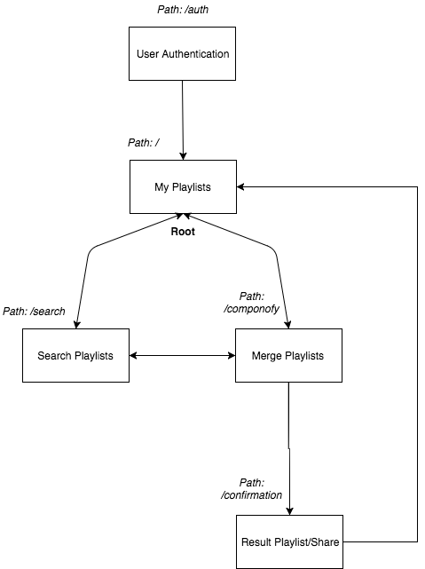

# The Spotify Playlist Merger Architecture

## Overview 
This document describes the high level description of what the architecture of the web application is going to be. 

## Name origin 
"Compono" translates "to put together" in [Latin](http://www.translate-latin.com/en/dictionary-english-latin/together). The ending "fy" is added nowadays just to make any noun a cooler verb. 

## Listing
* App flow
    * General 
    * Authentication
    * Playlists Page 
    * Playlist Management Page 
    * Confirmation Page
* API communication
* Routes
* Components
* Notes on Redux

## Content

### App Flow

#### General 
The app architecture will follow the Authentication Code flow described in the official Spotify API. 

#### Authentication 
In order to access the user's playlists, we need to get the `authentication token` that will be generated in the `Login` page. 
